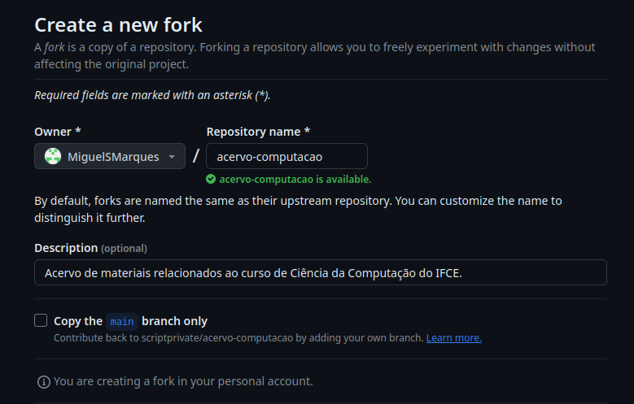
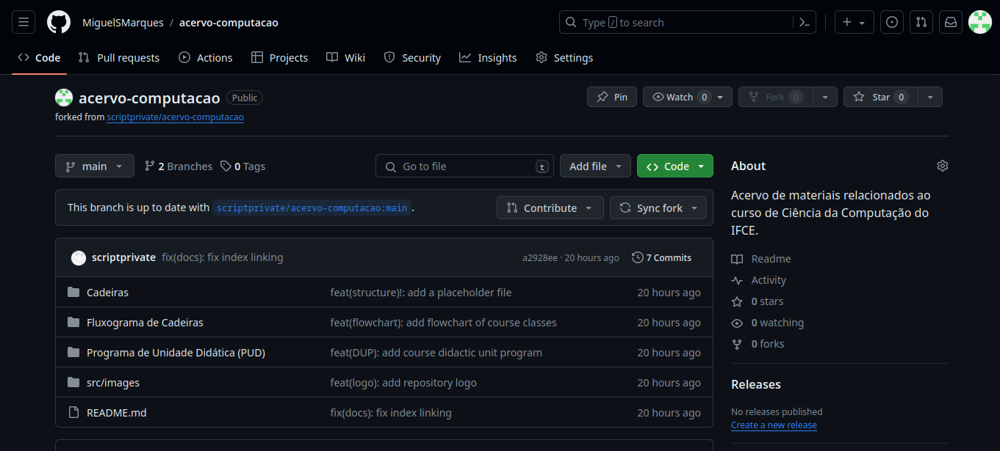
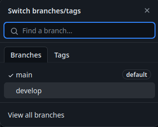
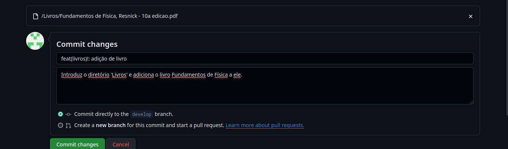
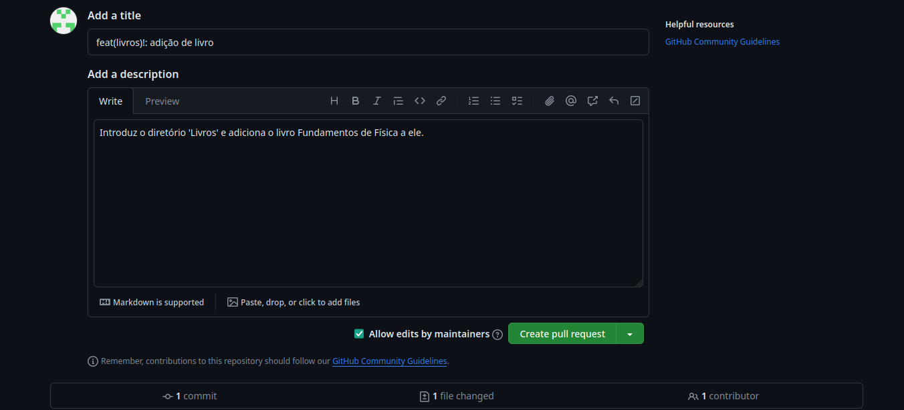
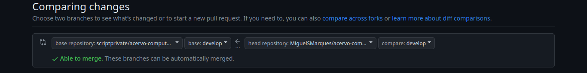

<p align="center">
  
  <h3 align="center"><b>Acervo da Computação</b></h3>
  <p align="center"><i>Acervo de materiais relacionados ao curso de Ciência da Computação do IFCE. </i></p>

---

### Índice
- [Introdução](https://github.com/scriptprivate/acervo-computacao?tab=readme-ov-file#introdu%C3%A7%C3%A3o)
- [Organização do Repositório](https://github.com/scriptprivate/acervo-computacao?tab=readme-ov-file#organiza%C3%A7%C3%A3o-do-reposit%C3%B3rio)
- [Como Contribuir](https://github.com/scriptprivate/acervo-computacao?tab=readme-ov-file#como-contribuir)

---

### Introdução

O objetivo desse repositório é servir como acervo de materiais relacionados ao curso de Ciência da Computação do IFCE, campus Maracanaú, contendo slides, livros, provas, trabalhos, e quaisquer outros materiais que possam servir de apoio para os estudantes. 

---

### Organização do Repositório 

O repositório é organizado em duas *branches*, a *main* e a *develop*. A *branch* *main* armazena o histórico de versionamento oficial do repositório, enquanto a *branch* *develop* serve como uma *branch* de integração para novos materiais que serão adicionados no acervo e em algum momento serão mesclados ou associados à main. 

A raiz do repositório deve conter apenas pastas com o nome do conteúdo que se encontrará dentro da pasta. Ex.:

```
├── Cadeiras
├── Fluxograma de Cadeiras
├── Programa de Unidade didática (PUD)
```

Se o conteúdo da pasta for abrangente, como é o caso da pasta *Cadeiras*, a pasta em questão deve delimitar seu conteúdo, o organizando em outras pastas. Ex.:

```
├── Cadeiras
│   └── Eletivas
│   └── S1
│   └── S2
│   ⋮ 
│   └── S8
```

As cadeiras são separadas por semestre (S1, S2, S3, ..., S8), com exceção das eletivas, que possuem uma pasta aparte. Dentro da pasta de cada semestre deve conter apenas pastas destinadas às cadeiras daquele respectivo semestre. Ex.:

```
├── Cadeiras
│   └── S1
│       ├── Cálculo I
│       ├── Circuitos Digitais
│       ├── Fundamentos de Programação
│       └── Matemática Discreta
```

Dentro da pasta da cadeira (ex.: Cálculo I), deve-se separar por pastas com o padrão de nomenclatura "Semestre - Nome do Professor" e, dentro de cada, organize os materiais por etapa. Ex.:

```
├── Matemática Discreta
│   └── 2023.2 - Cícero
│       ├── N1 - Lista de Exercícios para a Prova.jpeg
│       ├── N1 - Prova.jpeg
│       ├── N2 - Prova 1.jpeg
│       └── N2 - Prova 2.jpeg
```

Materiais que tendem a ser repetidos por vários semestres diferentes, como slides e livros, devem ficar em uma pasta separada. Ex.:

```
├── Laboratório de Programação
│   └── Slides - Daniel
│       ├── Linguagem C - Visão Geral.pdf
│       ├── Expressões em C.pdf
│       ├── Comandos de Controle de Programa.pdf
```

--- 

### Como Contribuir 

#### 1. Fazer um fork do repositório.

Para isso, basta clicar em:
   <p align="center">
    

Um botão que se localiza no canto superior direito do repositório.

Tendo clicado o botão, você será levado a uma tela parecida com a seguinte, em que você confirmará a criação de seu fork clicando em 'Create fork'
   <p align="center">
    

Vale ressaltar que, ao fazer a fork do repositório, você deve desmarcar a opção 'Copy the master branch only', que aparecerá na sessão inferior da página de fork, próxima ao botão de 'Create fork', como na imagem abaixo:
   <p align="center">
    

Agora, você deve ter um repositório em seu GitHub muito semelhante ao abaixo:
   <p align="center">
    

#### 2. Mudar a branch do seu fork para 'develop'.

É importante ressaltar que, conforme a sessão de [Organização do Repositório](https://github.com/scriptprivate/acervo-computacao?tab=readme-ov-file#organiza%C3%A7%C3%A3o-do-reposit%C3%B3rio) deste documento, os novos materiais a serem adicionados no acervo devem ser adicionados à branch de *develop*. Para tal, é clicar no botão em que está escrito 'master', no canto superior esquerdo de seu repositório, assim exibindo uma seleção como a da imagem abaixo, onde você irá clicar em 'develop'.
   <p align="center">
    

#### 3. Adicionar os novos arquivos no seu fork.

A forma mais fácil de fazer isso é simplesmente arrastar os novos arquivos para o seu repositório, mas, antes, é necessário abrir o repositório no diretório em que for feito o seu upload, respeitando a [Organização do Repositório](https://github.com/scriptprivate/acervo-computacao?tab=readme-ov-file#organiza%C3%A7%C3%A3o-do-reposit%C3%B3rio). O mesmo se aplica para no caso de haver necessidade de criação de alguma nova pasta, a criação da mesma deve respeitar a [Organização do Repositório](https://github.com/scriptprivate/acervo-computacao?tab=readme-ov-file#organiza%C3%A7%C3%A3o-do-reposit%C3%B3rio), e para a adição de pastas, é só abrir o repositório no local em que for feito o upload, novamente, respeitando a hierarquia da [Organização do Repositório](https://github.com/scriptprivate/acervo-computacao?tab=readme-ov-file#organiza%C3%A7%C3%A3o-do-reposit%C3%B3rio), e arrastar a pasta com arquivos dentro para o seu repositório. 
Outra forma simples é através do botão de 'Add file', que fica no cabeçalho de repositório, mas ainda se fazendo necessário abrir o repositório no diretório ou local em que for feito o upload de arquivos ou pasta com arquivos.

#### 4. Fazer commit dos arquivos no seu fork.

Ao adicionar os arquivos, ou pasta com arquivos, no seu fork, aparecerá uma tela de 'Commit changes', onde você escreverá a mensagem do commit descrevendo as alterações ou adições que foram feitas. Por fins de organização, esse repositório segue uma padronização de commits chamada [Conventional Commits](https://www.conventionalcommits.org/pt-br/v1.0.0-beta.4/). Exemplos de uso dessa padronização podem ser encontrados na sessão de [exemplos](https://www.conventionalcommits.org/pt-br/v1.0.0-beta.4/) do site de especificações do [Conventional Commits](https://www.conventionalcommits.org/pt-br/v1.0.0-beta.4/) e também no [histórico de commits](https://github.com/scriptprivate/acervo-computacao/commits/main/) deste mesmo repositório. 

Tendo escrito a mensagem de commit conforme a padronização, basta clicar em 'Commit changes', conforme o exemplo abaixo.
   <p align="center">
    

#### 5. Realizar o seu pull request.

Feito o commit dos arquivos no seu fork, uma mensagem aparacerá em seu repositório notificando que houve transferência de arquivos do seu repositório local para o seu repositório remoto, no caso, o seu fork. A mensagem se assemelha com a imagem abaixo:
   <p align="center">
    

Agora, basta clicar no botão 'Compare & pull request', te lavando para uma tela onde irá escrever o título de seu pull request e uma descrição do mesmo, que resumem a razão de seu pull request. O título e descrição de seu pull request devem ser feitos também seguindo a padronização de commits do [Conventional Commits](https://www.conventionalcommits.org/pt-br/v1.0.0-beta.4/), como no exemplo abaixo.
   <p align="center">
    

Após escrever o título e a descrição de seu pull request, é só clicar em 'Create pull request', suas mudanças serão comparadas com a branch de 'develop' do repositório original e aparecerá que suas mudanças estão hábeis para serem mergeadas na branch 'develop' do repositório original, como é ilustrado a seguir.
   <p align="center">
    

Com as suas mudanças agora hábeis para serem mergeadas, basta confirmar a criação do pull request e pronto, você contribuiu com o acervo!
